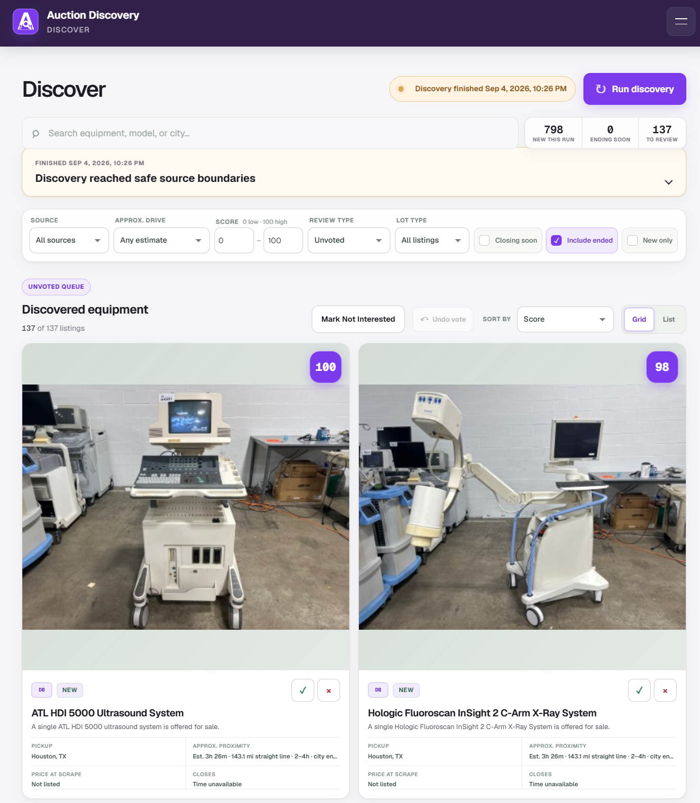
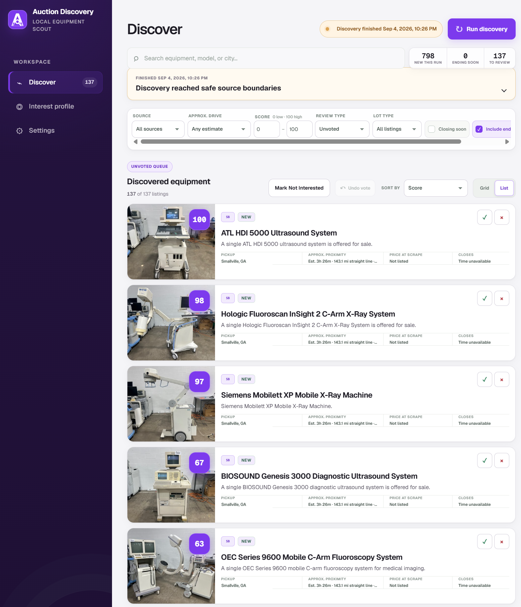
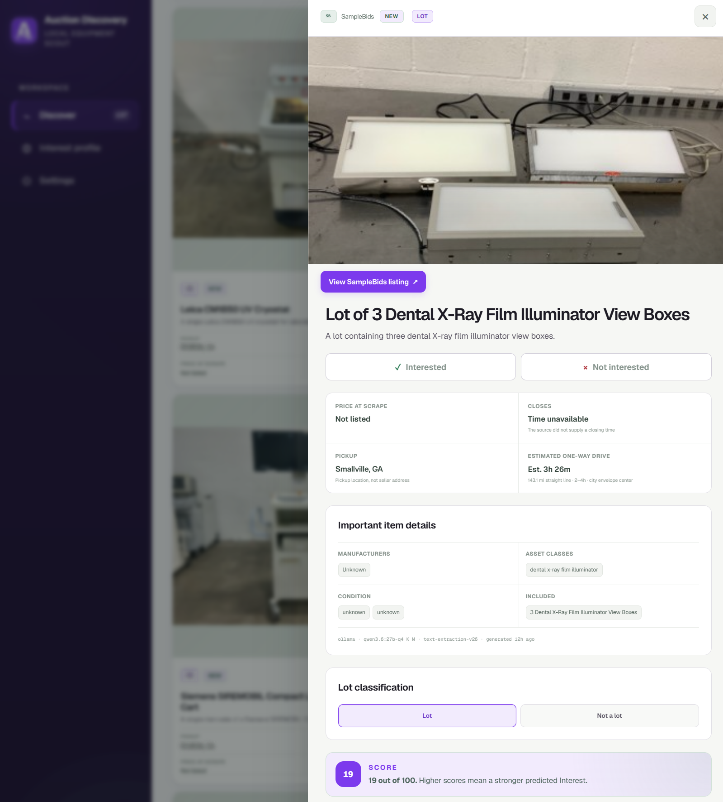
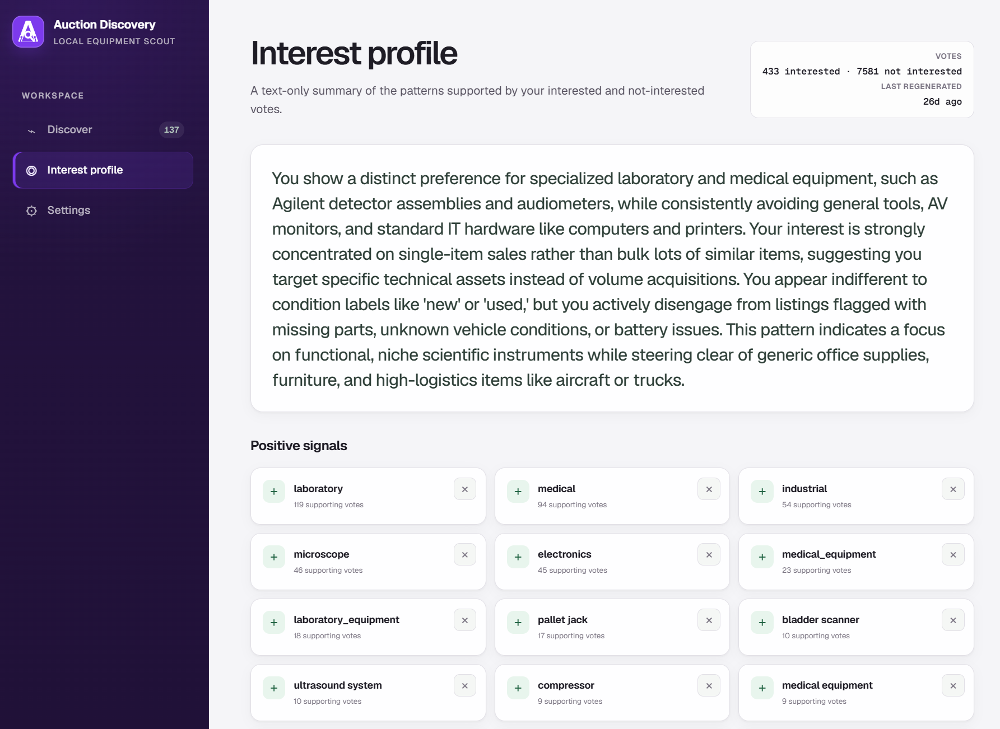
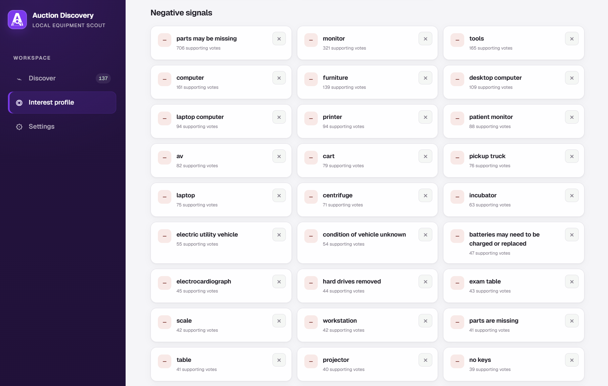

<h1 align="center"> Auction Discovery Dashboard</h1>

<p align="center">A local app to monitor obscure auction sites for listings you're interested in.</p>

<p align="center">
  <a href="https://github.com/wivy1/auction-discovery-dashboard/releases/latest"></a>
  
  <a href="LICENSE"></a>
</p>

If you're like me, you manually refresh 20 surplus auction sites a few times each week, reviewing all of the listings in all of the categories because the people posting the half-million-dollar piece of lab equipment have no idea how to describe what they are posting. I built Auction Discovery Dashboard to automate that process.

Auction Discovery Dashboard:
- Automatically scrapes all of your obscure auction sites.
- Enriches listings with manufacturer, model, equipment type, and condition, and lists all components of a batch lot.
- Estimates driving time to the pickup locations.
- Assigns a 0-100 interest score based upon your accumulated voting history (Interested vs. Not interested).

<p align="center">
  <a href="docs/screenshots/screenshot1.png"></a>
</p>

## How it works

### Discovering listings

Run discovery manually or schedule it to run unattended, including overnight. Each run:

1. Collects current listings from your sources.
2. Caches images locally and resolves pickup locations relative to your US ZIP code.
3. Groups eligible listings into estimated one-way drives of up to 2 hours, 2-4 hours, or 4-8 hours.
4. Extracts manufacturers, model numbers, equipment types, condition from listing text.
5. Identifies single items and multi-item lots, records the stated lot contents.
6. Assigns a 0-100 interest score to each listing based upon your voting history.

### Reviewing listings

Switch between grid and list views. Search, filter, and sort as desired.

<p align="center">
  <a href="docs/screenshots/screenshot3.png"></a>
</p>

Click on a listing to open a detail page.

<p align="center">
  <a href="docs/screenshots/screenshot2.png"></a>
</p>

Once you've reviewed a listing, mark it as **Interested** or **Not interested**. These votes feed into the preference scoring model, which assigns the numeric score visible on each listing.

### Tuning the preference model

The preference model learns associations between listing metadata and your **Interested** / **Not interested** votes. Higher scores indicate stronger predicted interest. 

The **Interest profile** summarizes these patterns and shows the tags contributing positive and negative signals. Reject individual tags when they misrepresent your interests.

<p align="center">
  <a href="docs/screenshots/screenshot4.png"></a>
</p>

<p align="center">
  <a href="docs/screenshots/screenshot5.png"></a>
</p>

## How to set up

Requires Windows 10 or 11, Node.js 22.13 or newer, pnpm 11.7.0, and a modern browser.

Clone the repository or [download the current `main` branch](https://github.com/wivy1/auction-discovery-dashboard/archive/refs/heads/main.zip). Extract to a writable folder and run:

```powershell
.\scripts\setup.cmd
Copy-Item .env.example .env.local
```

1. Configure your source adapters and (optional) models using the sections below. Browser-based sources also require `pnpm browser:install`.
2. Open **Auction Discovery.cmd**, wait for **Dashboard runtime is ready**, then visit [localhost:3000](http://localhost:3000). Keep the launcher terminal open.
3. In **Settings**, save your US ZIP code and enable your sources. Open **Discover** and click **Run discovery**.
4. Use **Settings > Scheduled discovery** to choose unattended run times.

### Adding auction sources

Setup creates `source-adapters.local.ts` from the [adapter examples](source-adapters.example.ts). Add an adapter for each site you follow, map its listing fields, and configure its permitted hosts, request limits, and access-review metadata. Register it in the file's exported array, restart, and enable it in **Settings**.

| Adapter | Source format |
| --- | --- |
| `createJsonApiSource` | Structured inventory from a JSON API over HTTP GET. |
| `createHtmlSource` | Listing markup parsed from fetched HTML pages. |
| `createHeadlessBrowserSource` | JavaScript-rendered pages captured with Playwright and Chromium. |

The templates expect a complete inventory document. Paginated inventories need a custom [SourceAdapter](lib/sources/types.ts).

### Configuring local AI

Listing enrichment and preference scoring require local AI models of your choosing. These features are optional; without the models, all discovered listings will show **Unrated**.

#### Listing enrichment

Install [Ollama](https://docs.ollama.com/quickstart) and supply a text model plus an embedding model.

My configuration (with an RTX 3090) is [Qwen3.6 27B Q4_K_M](https://ollama.com/library/qwen3.6:27b-q4_K_M) for structured extraction and [Qwen3-Embedding 0.6B](https://ollama.com/library/qwen3-embedding:0.6b) for embeddings. [Qwen3.5 9B](https://ollama.com/library/qwen3.5:9b), about 6.6GB, is a smaller text-model alternative. 

```powershell
ollama pull qwen3.6:27b-q4_K_M
ollama pull qwen3-embedding:0.6b
```

Set these values in `.env.local`:

```dotenv
AI_TEXT_PROVIDER=ollama
AI_TEXT_MODEL=qwen3.6:27b-q4_K_M
AI_EMBEDDING_PROVIDER=ollama
AI_EMBEDDING_MODEL=qwen3-embedding:0.6b
OLLAMA_BASE_URL=http://localhost:11434
```

Keep Ollama running and restart the launcher. This enables text enrichment. To use the smaller alternative, pull `qwen3.5:9b` and set `AI_TEXT_MODEL` to that exact name. Setup does not download models automatically.

#### Preference scoring

The [preference integration starter](docs/preference-training.md) provides configuration and data templates, plus typed hooks for training, scoring, profile generation, activation, and reading back the active model identity. You supply a compatible estimator and implement the required hooks and application connections. No trained model or working trainer/scorer is bundled. The Ollama models above handle listing enrichment.

1. Run `pnpm preference init` after setup. It creates ignored local configuration, an adapter, an empty training snapshot, and a model-manifest placeholder.
2. Populate `preferences.local/training-data.json` with your reviewed listings and signal corrections. Exporting the application's stored votes is part of your integration.
3. Implement the hooks in `preference-adapter.local.ts`. Train and evaluate your own estimator, or place a compatible downloaded model in `models.local/` and complete `preferences.local/model-manifest.json`.
4. Connect your scorer and generated profile to the application using the guide's [connection points](docs/preference-training.md#4-implement-activation-and-connect-the-application).

`pnpm preference check` validates file contracts and artifact hashes once your data and model are ready. `pnpm preference train`, `pnpm preference profile`, and `pnpm preference activate` call your implemented hooks. The profile command writes local JSON; your integration must publish the profile and scores to the dashboard.
